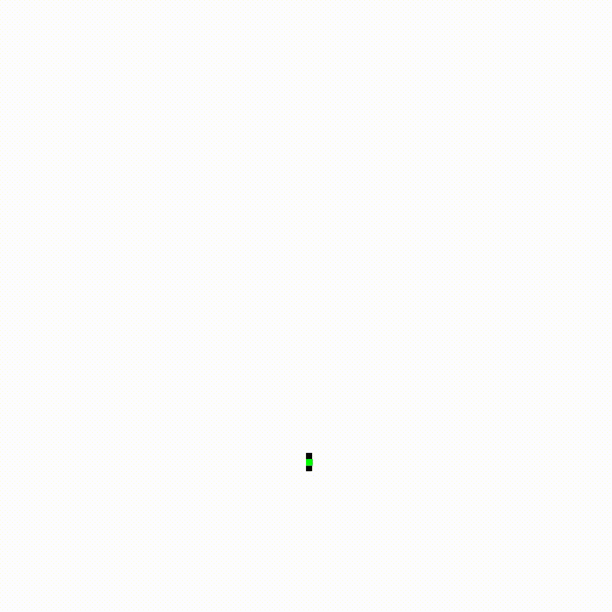
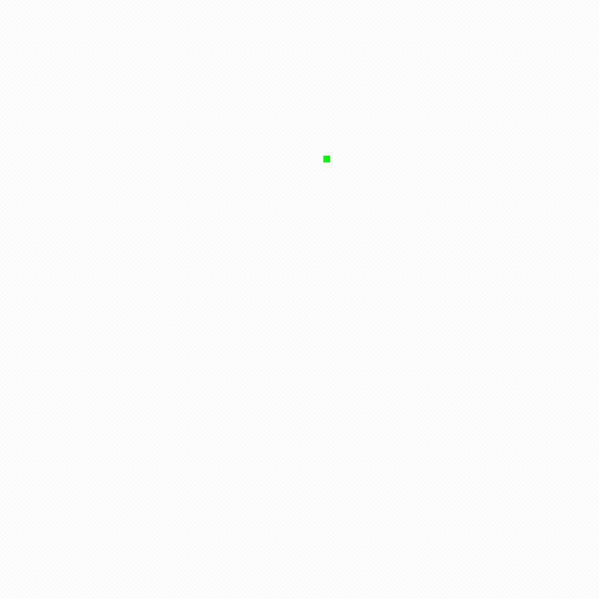
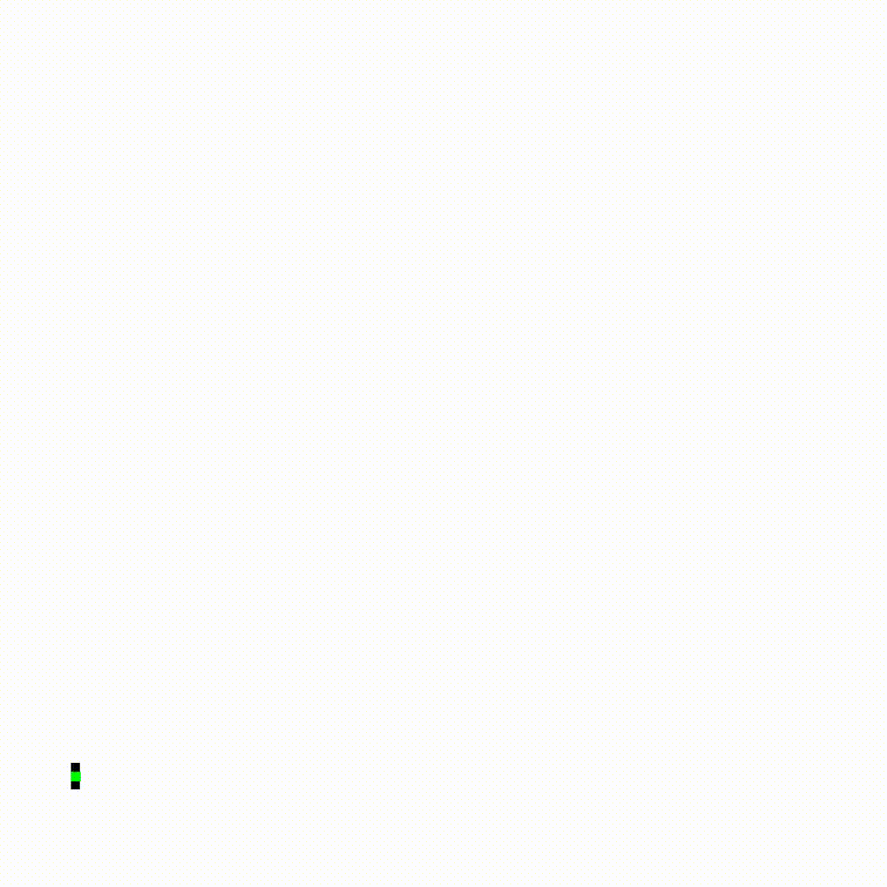
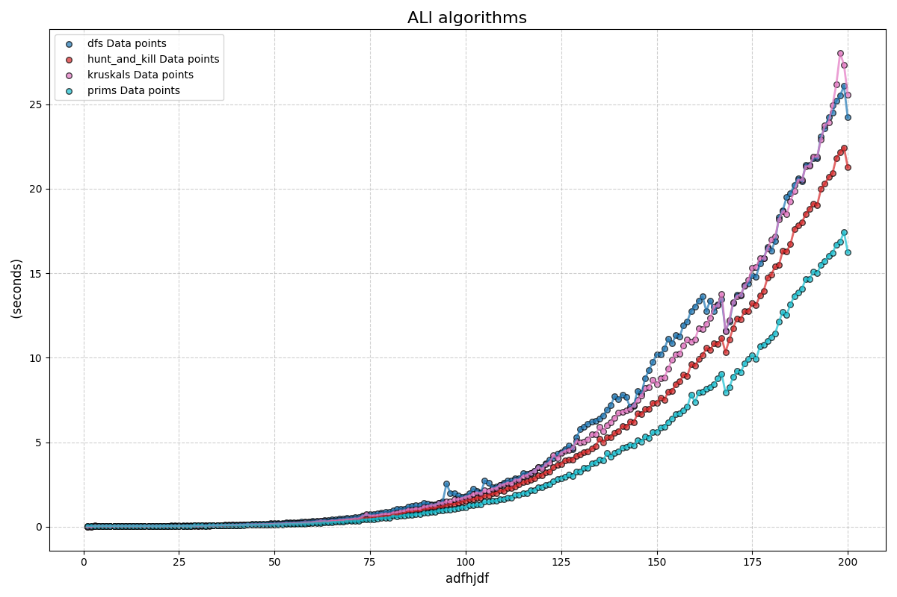

# A-Maze-ing Maze

## Component 1- Makes maze, heatmap, colormap, randommap and solves mazes.

### Logic to maze generation

Think of a maze as a graph:
- **Cells** = Vertices (Nodes)
- **Paths** = Edges (Connections)

### Constructing the Graph

1. **Vertices**: Each cell in the maze is a vertex.
2. **Edges**: An edge exists between two vertices if there's a path (no wall) between them.

### Perfect Maze = Tree

A perfect maze is like a SIMPLY tree in graph theory:
- **Tree**: A special graph that’s connected (every cell is reachable) and acyclic (no loops).
- **Unique Path**: In a perfect maze, there’s exactly one path between any two cells.

**So given this, any graph path finding algorithm or MST algorithm would work to generate a maze**

In component 1, we focus on path finding, heatmap and randommap generation.

## Component 2- Framework which animates generation of mazes (done in python 100% v1 folder) 

    
    

    
    

## Runtime with rendering (they're all the same)

    

   
## Visualization (1000x1000 grids) (3h render time for all)

Check out these animation technique for mazes using any method, expandable framework.

Top left- DFS method  
Bottom left- Prims method  
Top right- Hunt and Kill method  
Bottom right- Kruskalls method  

    
    

    
    

   
